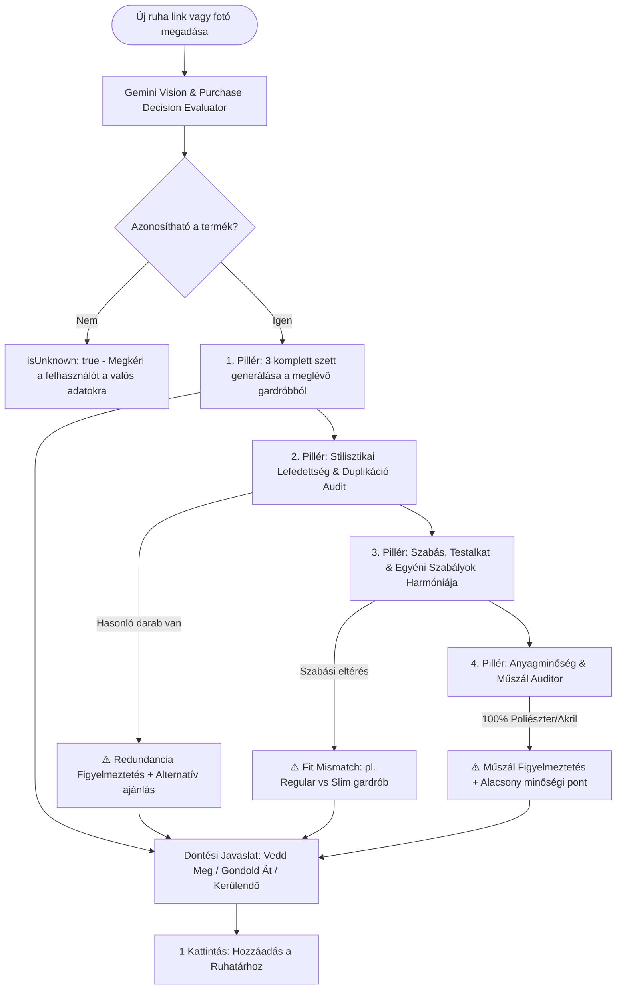

# 🏛️ Sartorial Wardrobe Assistant — Rendszertervezési és Architektúra Mesterterv (Master Blueprint)

> **Kiadási Verzió:** `v1.0 Build` (Production Ready)  
> **Dátum:** 2026. szeptember  
> **Cél:** Teljes körű, exportálható architektúra és gondolkodásmódbeli specifikáció a rendszer újraépítéséhez, továbbfejlesztéséhez vagy más platformra történő átültetéséhez.

---

## 1. 🧭 Filozófia és Gondolkodásmód (Core Mindset & Principles)

A **Sartorial Wardrobe Assistant** nem egy egyszerű leltár-alkalmazás, hanem egy mesterséges intelligenciával támogatott **személyes szabászati és stílustanácsadó rendszer**. A tervezés 5 alappillérre épül:

```
                      ┌────────────────────────────────────────┐
                      │   SARTORIAL WARDROBE ASSISTANT CORE   │
                      └──────────────────┬─────────────────────┘
                                         │
     ┌───────────────────┬───────────────┴───────────────┬───────────────────┐
     │                   │                               │                   │
┌────▼────────┐   ┌──────▼──────┐                 ┌──────▼──────┐     ┌──────▼──────┐
│  Olasz      │   │ Zero-Mock   │                 │ 4-Pilléres  │     │ Anatómiai   │
│ Sprezzatura │   │ Guarantee   │                 │ Vásárlási   │     │ Rétegezés & │
│ & Kapszula  │   │ 100% Real AI│                 │ Döntéskontroll│    │ Gallérmátrix│
└─────────────┘   └─────────────┘                 └─────────────┘     └─────────────┘
```

### 1.1. Olasz Sprezzatura & Kapszula Ruhatár Tudatosság
- **Cél:** A túlfogyasztás és impulzusvásárlások visszaszorítása a ruhatár variálhatóságának maximalizálásával.
- **Kapszula Szemlélet:** Kevesebb, de minőségi, egymással harmonizáló darab (természetes szálak: gyapjú, kasmír, pamut, len, selyem, bőr).
- **Sprezzatura:** A mesterkéletlen, természetes elegancia — ahol a színek, minták és textúrák találkozása harmonikus, mégsem túltervezett.

### 1.2. Zero-Mock & Anti-Hallucinációs Garancia (Szigorú Aranyszabály)
- **Zero-Mock Policy:** Szigorúan tilos bármilyen kamu/mock vagy heurisztikus szimuláció alkalmazása az AI funkcióknál. Minden döntést, elemzést és szett-összeállítást **valódi Google Gemini 3.x neurális modell** végez. Ha az AI hívás sikertelen (pl. lejárt kulcs, hálózati hiba), a valós hibaüzenetet kapja a felhasználó.
- **Anti-Hallucináció a Webshopoknál és Képeknél:** Ha egy webshop link vagy fotó alapján a termék nem azonosítható 100%-os bizonyossággal, az AI-nak tilos kitalálnia egy fantomruhát; helyette jelzi az azonosítás hiányát (`isUnknown: true`), és bekéri a valós adatokat.

### 1.3. A Vásárlás Előtti 4 Döntési Pillér („Megvegyem?” Kontroll)
Mielőtt a felhasználó megvásárolna egy új ruhát a próbafülkében vagy egy webshopban, a rendszer 4 szigorú auditon futtatja át:
1. **1. Pillér (Kombinálhatóság):** Össze tud-e állítani legalább 3 komplett, hordható szettet a *már meglévő* ruhatár darabjaival?
2. **2. Pillér (Stilisztikai Lefedettség & Duplikáció):** Van-e már a gardróbban funkcionálisan vagy vizuálisan azonos szerepű darab (pl. egy másik sötétkék zakó vagy sötétbarna loafer)? Ha igen, felhívja a figyelmet a redundanciára és alternatívát javasol.
3. **3. Pillér (Személyes Illeszkedés, Szabás & Szabályok):** Illik-e a felhasználó testalkatához, bőrtónusához, méretéhez és az általa definiált egyéni stílusszabályokhoz?
4. **4. Pillér (Anyagminőség & Műszál Auditor):** 100% műszálas, nem lélegző poliészter/akril/műbőr esetén figyelmeztetést ad, és a döntést 'Gondold Át' vagy 'Kerülendő' státuszra állítja.

### 1.4. Sartorial Gallér- és Ujj-Harmónia Rendszer (Layering Matrix)
A szabászati rétegezési szabályok kőbe vésett logikája:
- **Ingdzseki (Shacket / Overshirt):** Tilos alá hagyományos galléros inget venni (kettős inggallér és kettős gombsor stílushiba). Csak prémium pamut pólóval, finomkötött kereknyakúval vagy merinó garbóval rétegezhető.
- **Állógalléros ing (Mandarin / Mao / Grandad):** Tilos zárt kötött pulóverrel vagy hagyományos hajtókás öltönyzakóval hordani. Önmagában vagy nyitott kardigánnal / gallér nélküli dzsekivel hordandó.
- **Garbó (Turtleneck):** Önálló bázist képez; alatta nem viselünk inget.
- **Rövid ujjú kötöttáru:** Alatta nem viselünk rövid ujjú pamutpólót a kettős ujjvég és a gyűrődés elkerülésére.
- **Kötelező Bázisréteg (Anatómiai Szabály):** Egy szett sem maradhat belső réteg nélkül (ing vagy prémium póló); zakót vagy pulóvert tilos bázis nélkül ajánlani.
- **Szezonális Lábbelivédelmi Dinamika:** Meleg időben (>= 19°C) kizárt a csizma, bakancs és télikabát; hűvös/hideg időben (< 14°C) támogatott a télikabát + zakó kettős réteg és a Chelsea/Chukka bőrcsizma.

---

## 2. 🏗️ Technológiai Stack és Rendszerarchitektúra

```
┌─────────────────────────────────────────────────────────────────────────────┐
│                            FRONTEND KLIENS (SPA / PWA)                      │
│   React 18  •  Vite  •  TailwindCSS  •  Luxury Gold Glassmorphism System     │
└──────────────┬───────────────────────────────┬──────────────────────────────┘
               │                               │
               ▼                               ▼
┌───────────────────────────────┐ ┌───────────────────────────────────────────┐
│     AI & MULTIMODAL MOTOR     │ │     PERZISZTENCIA & SZINKRONIZÁCIÓ        │
│ • Google Gemini 3.x Flash-Lite│ │ • Firebase Authentication (Google/Guest)  │
│ • Gemini 3.7 Flash & Reasoning│ │ • Cloud Firestore (Real-Time onSnapshot)  │
│ • Self-Healing JSON Parser    │ │ • LocalStorage Offline Fallback           │
│ • Google Search Rule Grounding│ │ • Multi-User & Admin Privilege Isolation  │
└──────────────┬────────────────┘ └───────────────────────────────────────────┘
               │
               ▼
┌─────────────────────────────────────────────────────────────────────────────┐
│                        KLIENS OLDALI MOTOROK & PIPELINE                      │
│ • Canvas 640x640 @ 0.75 JPEG Optimizer (~35-50 KB per kép)                  │
│ • Webshop Multi-CDN Parser (Next Direct, Zara, Reserved, Massimo Dutti, ...)│
│ • Open-Meteo Valós Idejű Időjárás API                                        │
│ • Web Share Target API (Mobil Megosztás és Facebook Browser integráció)     │
└─────────────────────────────────────────────────────────────────────────────┘
```

### 2.1. Részletes Technológiai Összetevők:
| Réteg | Technológia | Felelősség |
|---|---|---|
| **UI Keretrendszer** | React 18, Vite | Komponens alapú reaktív felület, gyors HMR és build |
| **Design System** | TailwindCSS + Egyedi CSS Változók | Obszidián-arany üveghatás (`glass-card`, `glass-panel`, `gold-gradient-text`) |
| **Ikonkészlet** | `lucide-react` | Konzisztenst, elegáns vektoros ikonok |
| **AI LLM & Vision** | Google Gemini 3.x API | `gemini-3.5-flash-lite`, `gemini-3.7-flash`, `gemini-3.6-flash`, `gemini-3.1-flash-lite` |
| **Autonóm Szabálykutató** | Gemini Search Grounding | Webes szabászati kódexek keresése és szinkronizálása |
| **Adatbázis & Auth** | Firebase 11 (Auth + Firestore) | Kétirányú valós idejű szinkron mobil és asztali böngésző között |
| **Képfeldolgozás** | HTML5 Canvas API | Vágólap, kamera és feltöltött képek 640x640-re tömörítése Base64-ben |
| **Időjárás** | Open-Meteo REST API | Geokódolás + valós idejű hőmérséklet és időjáráskód |
| **PWA & Mobil** | Service Worker + Manifest | Mobiltelepíthetőség, offline gyorsítótár, Web Share Target |

---

## 3. 🔄 A 10 Alapvető Munkafolyamat (Core Workflows Step-by-Step)

### 📸 Workflow 1: Ruhafelvitel & Multimodális AI Vision Elemzés
```mermaid
sequenceDiagram
    autonumber
    actor Felhasznalo as Felhasználó
    participant UI as AddClothingModal
    participant Opt as ImageOptimizer (Canvas)
    participant WS as WebshopEngine
    participant AI as Gemini 3.x Flash Vision
    participant DB as Cloud Firestore

    alt 1. Fotózás / Galéria Kép
        Felhasznalo->>UI: Kép készítése vagy fájl kiválasztása
        UI->>Opt: Átméretezés (640x640 @ 0.75 JPEG)
    else 2. Vágólap (Ctrl+V / Kép beillesztése)
        Felhasznalo->>UI: Böngészőből jobb klikk -> Másolás -> Ctrl+V
        UI->>Opt: Kép konvertálása Base64 formátumba
    else 3. Webshop Terméklink vagy Cikkszám (SKU)
        Felhasznalo->>UI: Beilleszti a linket vagy termékkódot (pl. Next SU415329)
        UI->>WS: parseWebshopUrlOrCode + findFirstWorkingImageUrl
        WS-->>UI: CDN kép URL + Cikkszám és márka kontextus
        UI->>Opt: CDN kép letöltése és Base64 konvertálása
    end

    UI->>AI: analyzeClothingImage(base64Image, webshopContext, userProfile)
    Note over AI: Elemzi: kategória, alkategória, szín, anyagösszetétel, formalitás (1-5), stílus archetipus, szezonalitás, minta, márka, méret
    AI-->>UI: Strukturált JSON válasz
    UI->>Felhasznalo: Kitöltött űrlap megjelenítése (azonnali szerkesztési lehetőség)
    Felhasznalo->>UI: Mentés gombra kattintás
    UI->>DB: setDoc(users/{uid}/wardrobe/{id}, itemData)
    DB-->>UI: Realtime szinkron visszaigazolás
```

---

### 🛍️ Workflow 2: Vásárlás Előtti 4-Pilléres Döntéstámogatás & Szabás-ellenőrzés


---

### 👔 Workflow 3: Esemény- és Kulturális Dress Code AI Stylist & Rétegezési Motor
1. **Esemény Dekódolás:** A beírt esemény jellegének, helyszínének és kulturális normáinak értelmezése (pl. underground klub, toszkánai esküvő, formális üzleti tárgyalás).
2. **Kulturális Tiltólisták Alkalmazása:**
   - *Techno / Rave / Club:* Szigorúan kizárja a formális zakókat, nyakkendőket és öltönynadrágokat.
   - *Formális esemény:* Kizárja a lezser sportos, játszós és kopott darabokat.
3. **Anatómiai Rétegezés & Gallérmátrix Kikényszerítése (`enforceAnatomicalOutfitLayers`):**
   - Minden szettnek kötelezően tartalmaznia kell egy bőrön hordható bázisfelsőt (`tops`).
   - Ingdzseki alá tilos galléros inget tenni.
   - Állógalléros inghez tilos zárt pulóvert vagy klasszikus hajtókás zakót párosítani.
   - Meleg időben (>= 19°C) kizárja a meleg csizmákat és télikabátokat.
   - Hideg időben (< 14°C) támogatja a zakó + téli szövetkabát kettős réteget.
4. **Kulcsdarab (Anchor Item) Rögzítés:** A felhasználó kijelölhet egy konkrét ruhadarabot a gardróbjából, amely köré az AI kötelezően felépíti a szetteket.
5. **Kimenet:** 3 hiteles, komplett szett részletes magyarázattal (`culturalFitReasoning`) és rétegezési tanáccsal (`layeringAdvice`).

---

### 🧩 Workflow 4: Kapszula Ruhatár Gap Elemzés & Szezonális Audit
1. **Szezonális Lábbeli Audit (1. Számú Prioritás):**
   - Ha a gardróbban 0 db őszi/téli cipő van (nincs Chelsea, Chukka vagy téli elegáns bőrlábbeli), a rendszer azonnal 1. prioritású kritikus hiányként jelöli meg.
2. **Kategória Telítettségi Stop (Saturation Guard):**
   - Ha egy felső kategóriából (pl. ingek) már van 2+ jó állapotú darab, tilos újabb hasonlót ajánlani, amíg az alapkategóriák nincsenek lefedve.
3. **Kapszula Ruhatár Index Számítása:** Figyelembe veszi a kategória-lefedettséget, állapotarányokat és a variálhatósági mutatót.
4. **Szabásérzékeny Keresőkifejezések:** A hiányzó darabok nevébe beépíti a felhasználó preferált szabását (pl. *"Slim Fit Sötétkék Olasz Gyapjú Zakó"*).

---

### 📏 Workflow 5: Gyártói Méretprofil & Kanonikus Márkanévtér
1. **Kanonikus Márka-Összefűzés (`normalizeBrandName`):**
   - A rendszer a domain alapú (pl. `reserved.com` ➔ `Reserved`, `next.co.uk` ➔ `Next Direct`), kelmefabrikos (pl. `Next (Nova Fides)` ➔ `Next Direct`), valamint eltérő kis- és nagybetűs elnevezéseket egyetlen közös márkanév alá fűzi össze.
2. **Kategóriánkénti Bázisméretek:**
   - Automatikusan összesíti a kategóriánként domináns méreteket (Zakó: 50, Ing: 40/M, Nadrág: 32/32, Cipő: 42.5).
3. **Gyártói Illeszkedési Mátrix:**
   - Márkánként nyilvántartja a bevált méreteket (pl. Boglioli ➔ 50, Eton ➔ 40, Incotex ➔ 32/32), amely vásárláskor azonnali méretválasztási tanácsként jelenik meg.

---

### 🧠 Workflow 6: Szabad Szöveges AI Stylist Tanítás & Egyéni Szabályrendszer
1. **Szabad Szöveges Rögzítés:** A felhasználó a `StyleDNAView` felületen kötetlen mondatokban megadhatja személyes öltözködési szabályait (pl. *"Nem szeretem a pólóingeket"*, *"Csak 100% természetes anyagok"*, *"Kerülöm a skinny szabást"*).
2. **Keresztfunkciós Érvényesítés:**
   - **Stylist Motor:** Szigorúan kizárja a tiltott kombinációkat.
   - **Gap Elemző:** Sosem ajánl olyan darabot, amit a felhasználó kizárt.
   - **Vásárlási Tanácsadó:** Automatikusan észleli az ütközést és azonnali figyelmeztetést generál.

---

### 👔 Workflow 7: Saját Szett Összeállítása & Sartorial AI Audit
1. **Interaktív Szettépítő:** A felhasználó kategóriánként válogatja össze a darabjait (Felső, Pulóver, Zakó/Kabát, Nadrág, Cipő, Öv/Kiegészítő).
2. **4-Dimenziós Sartorial AI Audit (`auditManualOutfit`):**
   - *Dress Code & Esemény Összhang* (0-100%)
   - *Színharmónia & Kontraszt* (3-szín szabály, hideg/meleg tónusok)
   - *Anyagok & Textúrák Találkozása* (természetes szálak harmóniája)
   - *Rétegezés & Időjárási Dinamika* (hőmérsékleti komfort)
3. **Eredmény:** Százalékos összhang-pontszám, konkrét erősségek és javítási javaslatok, valamint egykattintásos mentés a kedvencekhez.

---

### 💬 Workflow 8: Szabad Szöveges Személyes AI Stylist Csevegés (Master Stylist Chat)
1. **Teljes Gardrób- és DNS-Kontextus:** A Gemini 3.x közvetlen beszélgetésben áll a felhasználóval, és ismeri a gardrób összes darabját, a Stílus DNS-t, a méreteket, a kedvenc színeket és az aktuális helyi időjárást.
2. **Interaktív Képi Hivatkozások:** Bármilyen ruhadarab említésekor az AI automatikusan interaktív kártyaként jeleníti meg a ruhát a válasz alatt, amelyre kattintva megnyílik a nagyfelbontású Lightbox.

---

### 📱 Workflow 9: Mobil Web Share Target & Facebook In-App Browser Integráció
1. **Web Share Target API:** Mobilon a webshop oldalán a „Megosztás” gombra kattintva a **Wardrobe Assistant** célalkalmazásként jelenik meg.
2. **Azonnali Elemzés Indítása:** Az app megnyitáskor automatikusan kiszűri a terméklinket (Facebook/Messenger előtagok közül is), átvált a Vásárlási Tanácsadó nézetre, és azonnal elindítja a 4-pilléres tesztet.

---

### 🌐 Workflow 10: Autonóm Stílus-DNS Vezérelt Szabálykutató (Rule Mining)
1. **Személyre Szabott Keresési Fókusz (`constructPersonalizedMiningTopics`):** A felhasználó Stílus DNS-e és a gardrób darabjainak stílusmegoszlása alapján dinamikusan állítja össze a Google Search Grounding keresési témáit.
2. **Kutatómotor (`mineSartorialRulesFromWeb`):** Nemzetközi divatkódexekből (Savile Row, Pitti Uomo, Vogue, Permanent Style, Die Workwear) autentikus szabályokat nyer ki, és stíluscímkékkel (`targetStyles`) látja el őket.
3. **7-Napos Automatikus Háttér-Szinkronizáció:** 7 naponta a háttérben frissíti és deduplikálja a szabálytárat a Cloud Firestore-ban.

---

## 4. 🗄️ Adatmodellek és Sémák (Data Models & Schemas)

### 4.1. `ClothingItem` (Ruhatári Elem)
```typescript
interface ClothingItem {
  id: string;                      // Egyedi azonosító (pl. "item-1725450000000")
  name: string;                    // Megnevezés (pl. "Sötétkék Olasz Gyapjú Zakó")
  category: 'tops' | 'bottoms' | 'outerwear' | 'knitwear' | 'shoes' | 'accessories';
  subCategory?: string;            // pl. "blazer", "shirt", "loafer", "chelsea_boots"
  color: string;                   // Domináns szín (pl. "Sötétkék")
  colorHex?: string;               // Színkód hexában (pl. "#1e293b")
  secondaryColors?: string[];      // Kiegészítő színek
  material: string;                // Anyagösszetétel (pl. "100% Olasz Gyapjú (Nova Fides)")
  materialCategory?: 'natural' | 'blend' | 'synthetic';
  pattern?: string;                // pl. "Sima", "Halszálkás", "Kockás", "Csíkos"
  formalityLevel: 1 | 2 | 3 | 4 | 5; // 1: Casual / Játszós, 5: Ultra Formális / Black Tie
  styleArchetype?: 'classic_sartorial' | 'smart_casual' | 'urban_minimalist' | 'casual_weekend' | 'streetwear' | 'sporty' | 'formal_evening';
  season: 'all' | 'summer' | 'winter' | 'transition';
  fit?: 'slim_tailored' | 'regular_fit' | 'relaxed_oversized';
  condition?: 'new_or_pristine' | 'good_daily' | 'worn_needs_care' | 'needs_replacement';
  brand?: string;                  // pl. "Boglioli", "Massimo Dutti", "Next Direct"
  size?: string;                   // pl. "50", "40 / M", "32/32", "42.5"
  productUrl?: string;             // Eredeti webshop link
  productCode?: string;            // Cikkszám / SKU (pl. "AA6536", "SU415329")
  imageUrl: string;                // Base64 tömörített kép vagy CDN kép URL
  styleTips?: string[];            // AI viselési és kombinációs tanácsok
  tags?: string[];                 // Keresőcímkék
  createdAt: string;               // ISO Timestamp
  updatedAt?: string;
}
```

### 4.2. `UserProfile` / `StyleDNA`
```typescript
interface UserProfile {
  uid?: string;
  name: string;
  height: string;                  // pl. "182 cm"
  weight: string;                  // pl. "79 kg"
  bodyType: 'trapezoid_athletic' | 'v_shape' | 'rectangle' | 'oval' | 'inverted_triangle';
  skinTone: 'warm_autumn' | 'warm_spring' | 'cool_summer' | 'cool_winter';
  gender: 'universal' | 'menswear' | 'womenswear';
  preferredStyles: string[];       // pl. ["classic_sartorial", "smart_casual"]
  favoriteColors: string[];        // pl. ["Sötétkék", "Tevebarna", "Krémfehér", "Bordó"]
  stylePhilosophy?: string;        // Szabad szöveges összefoglaló
  customStylingRules?: string;     // Szabad szöveges egyéni tiltások és szabályok
  brandSizes?: Record<string, string>; // pl. { "Boglioli": "50", "Eton": "40" }
  updatedAt: string;
}
```

### 4.3. `SartorialRule` (Stílusszabály)
```typescript
interface SartorialRule {
  id: string;
  category: 'collar_harmony' | 'sleeve_hierarchy' | 'silhouette_balance' | 'fabric_synergy' | 'color_and_contrast' | 'footwear_and_proportions' | 'leather_and_metals' | 'finishing_touches' | 'womenswear_specific';
  title: string;
  ruleDescription: string;
  dont: string;                    // Mit kerüljünk (❌ Don't)
  do: string;                      // Helyes megoldás (✅ Do)
  targetStyles?: string[];         // pl. ["classic_sartorial", "smart_casual"]
  gender: 'universal' | 'menswear_specific' | 'womenswear_specific';
  severity: 'strict' | 'guideline' | 'flexible';
  source: string;                  // pl. "Savile Row Bespoke Code", "Permanent Style"
  enabled: boolean;
  discoveredAt: string;
}
```

---

## 5. 🎨 Design System & UX Szabályok (Luxury Gold Glassmorphism)

### 5.1. Színpaletta és Vizuális Tokenek:
- **Háttér Obszidián:** `#0b0e14`, `#12100e`, `#07090e`
- **Pezsgőarany Accent:** `#d4af37`, `#c8a97e`, `#f59e0b`
- **Finom Keretek:** `rgba(212, 175, 55, 0.25)` és `rgba(255, 255, 255, 0.08)`
- **Kártya Üveghatás:** `backdrop-blur-md bg-white/[0.03] border border-white/10 hover:border-[#d4af37]/40`

### 5.2. Mobile-First & Érintésbarát Ergonómia Szabályai:
1. **Érintőfelületek:** Minden gomb és kattintható elem magassága és szélessége legalább **40×40 px**.
2. **Lebegő Alsó Navigáció Margója:** A fő tartalom konténerének kötelező az alsó **`pb-28 sm:pb-24`** margó, hogy a lebegő menüsáv soha ne takarja ki a tartalmat.
3. **Szövegtúlcsordulás Védelem:** Minden flexbox sorban kötelező a **`min-w-0`** és `truncate` osztályok használata a hosszú márka- és termékneveknél.
4. **Képarányok:** A ruhakártyákon a képek nem torzulnak; **`aspect-[4/3]`** és `object-cover` vagy `object-contain` szabályok biztosítják a tiszta látványt.

---

## 6. 🚀 Lépésről Lépésre Újraépítési Útmutató (Re-Implementation Roadmap)

Ha a projektet a nulláról kell újra felépíteni, kövesd az alábbi 8 fázisból álló mérföldkövet:

```
┌────────────────────────────────────────────────────────────────────────┐
│              ÚJRAÉPÍTÉSI ÚTVONALTERV (PHASE 1 - PHASE 8)              │
└──────────────────────────────────┬─────────────────────────────────────┘
                                   │
  Phase 1 ──► Környezet, Vite, Tailwind & Luxury Gold Design System
  Phase 2 ──► Kliens Képoptimalizáló (Canvas) & Firestore Szinkronizáció
  Phase 3 ──► Gemini 3.x AI Motor & Self-Healing JSON Parser
  Phase 4 ──► Digitális Ruhatár & Vision Képelemző Modul
  Phase 5 ──► AI Stylist, Anatómiai Rétegezés & Időjárás Integráció
  Phase 6 ──► 4-Pilléres Vásárlási Tanácsadó & Kapszula Gap Elemző
  Phase 7 ──► Stílus DNS, Szabálytár & Autonóm Web Rule Mining
  Phase 8 ──► PWA, Mobil Web Share Target, Tesztelés & Kiadás (v1.0 Build)
```

### 1. Fázis: Projekt Alapok & Design System
- Hozz létre egy Vite + React projektet TailwindCSS-szel és Lucide ikonokkal.
- Implementáld a Luxury Gold Glassmorphism CSS változókat (`src/styles/index.css`).
- Építsd fel az alapvető keretet: `Header`, `DesktopTabs`, `BottomNav`.

### 2. Fázis: Képoptimalizálás & Perzisztencia
- Írd meg a Canvas-alapú képfeldolgozót (`src/services/imageOptimizer.js`: 640×640 @ 0.75 JPEG).
- Állítsd be a Firebase Auth és Firestore real-time listener kapcsolatot (`src/services/firebase.js`, `src/context/AuthContext.jsx`).

### 3. Fázis: Gemini AI Motor & JSON Hibatűrés
- Hozd létre a robusztus Gemini API hívót (`src/services/gemini.js`):
  - Fast timeout (8 mp) és automatikus fallback modellek (`gemini-3.5-flash-lite`, `gemini-3.7-flash`).
  - Active fast model in-memory gyorstárazás a 0 ms késleltetéshez.
  - Öngyógyító JSON parser (`safeParseJson`).

### 4. Fázis: Gardrób & Vision Felvitel Modul
- Készítsd el az `AddClothingModal` és `WardrobeView` komponenseket.
- Kösd be a közvetlen fotózást, galéria feltöltést, vágólapot (Ctrl+V) és a webshop link/SKU feldolgozást (`src/services/webshop.js`).

### 5. Fázis: AI Stylist & Rétegezési Motor
- Építsd meg az eseményalapú outfit generátort (`generateEventOutfits`).
- Érvényesítsd a gallérmátrixot és az anatómiai rétegezési szabályokat (`enforceAnatomicalOutfitLayers`).
- Kösd be a valós idejű Open-Meteo időjárás API-t (`src/services/weather.js`).

### 6. Fázis: Vásárlási Tanácsadó & Gap Elemző
- Implementáld a 4-pilléres vásárlás előtti tesztet (`evaluateAndExtractPrePurchaseItem`).
- Építsd meg a Kapszula Ruhatár Gap Elemzőt (`analyzeWardrobeGaps`) 1. prioritású téli cipő audittal és telítettségi korláttal.

### 7. Fázis: Stílus DNS, Szabálytár & Rule Miner
- Hozd létre a `StyleDNAView` komponenst testalkat, bőrtónus, egyéni szabályok és márkaméretek kezelésére.
- Implementáld a Google Search Grounding szabálykutató motort (`src/services/sartorialRules.js`) 7 napos automatikus háttér-szinkronizációval.

### 8. Fázis: PWA Mobil Megosztás & Kiadás
- Konfiguráld a `manifest.json` fájlt `share_target` beállítással a közvetlen mobil megosztáshoz.
- Állítsd be a Service Worker gyorsítótárazást (`public/sw.js`).
- Ellenőrizd a verziókezelést (`src/version.js`) a hivatalos `v1.0 Build` kiadáshoz.

---
*Készült a Sartorial Wardrobe Assistant projekt hivatalos műszaki dokumentációjaként.*
